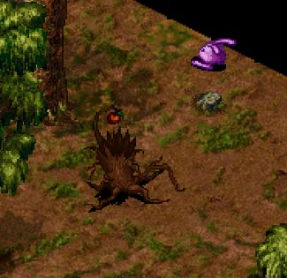

# 포테의 숲 몬스터 원작 참조 리빌드 v1

이 경로는 기존 v0.4 생성물과 분리된 새 후보 작업입니다. 기존 v0.4의 168장은 참조 이미지로 사용하지 않습니다.

## 확정 요구와 현재 상태

- 확정 요구: 종/색상형마다 대기 4방향 + 걷기 4방향 + 공격 4방향, 총 12개의 개별 이미지.
- 전체 대상은 레드/그린/퍼플/실버 팜팻, 트랜트, 앤트라이온, 놀, 울프라이더, 라이칸스로프, 앤트자이언트, 은빛늑대, 갈색/검은색 포테의 정령, 자이언트 맨티스의 14개 종/색상형입니다.
- 저장소에 확인된 새 후보는 라이칸스로프 12개뿐이며, 사용자가 해당 종의 시각 결과를 승인했습니다. 다른 종 13개 × 12개 = 156개는 미완료입니다.
- 직전 작업 회차에서 120개라고 보고했으나, 현재 저장소를 다시 확인한 결과 그 파일들은 체크아웃에 없습니다. 추적 가능한 결과로 계산하지 않으며 상태를 저장소 기준 12개로 정정합니다.
- 원격 작업 브랜치도 확인했습니다. 폐기 지시된 v0.4 168장 묶음은 `codex/lycanthrope-reference-grounded-assets`에 남아 있으나 새 디자인 입력에서 제외합니다. 다른 미병합 Pote 브랜치에는 보라 팜팻의 대기 4장·구르기 공격 4장 prototype이 있지만 걷기 프레임이 없고 원작 추출물이 아니어서 168장 완료 수량에 넣지 않습니다.
- 네이버 이미지 검색에서 포테 숲 실제 플레이 화면을 보존했습니다. 화면 속 보라 토끼형 및 나무형 개체는 각각 팜팻/트랜트 후보이며 이름표가 안 보여 미확정입니다. 새 PDF 두 개와 영상 두 개에서는 별도의 종별 sprite/frame을 확인하지 못했습니다.
- 기준 자료: [`source_audit.md`](source_audit.md), [`monster_artwork_manifest.csv`](monster_artwork_manifest.csv), [`lycanthrope_review.md`](lycanthrope_review.md), [`lycanthrope_manifest.csv`](lycanthrope_manifest.csv).
- 후보 이미지는 미리보기·개별 PNG 검수와 사용자의 시각 승인을 거치기 전 APK에 넣지 않습니다.

## 사실과 생성 후보 구분

원작 참고 스크린샷에서 보이는 갑옷 늑대인간의 직립 실루엣, 짙은 갑옷, 은색 판금, 붉은 천, 한손 검을 해당 종의 디자인 기준으로 삼았습니다. 캡처에 없는 나머지 방향 및 걷기·공격 모션은 생성 후보입니다. 다른 종은 종별 원작 외형을 임의 추정하지 않습니다. 원작 프레임 또는 미검수 이미지를 원작 원본·수락 완료라고 표기하지 않습니다.

위 화면은 환경/실루엣 출처 후보이며, 그 자체를 개별 스프라이트나 수락된 아트로 간주하지 않습니다.

## 2026-09-29 생성 작업 기록

- 빨간 팜팻 12개 개별 방향/상태 이미지를 신규 생성했습니다. 이미지들은 `sprites/red_pamfet/`에 저장합니다.
- 이 이미지는 원작 게임 스프라이트를 추출한 것이 아니라 후보 생성물입니다. 현재 1254×1254 원본 PNG이며, 64×64 게임 프레임으로 축소·정렬 및 기술 검수가 끝나지 않았습니다. 따라서 완성/승인/런타임 적용으로 세지 않습니다.
- 팜팻의 공격 후보는 요청한 구르기 실루엣을 반영합니다. 방향별 정확성과 원작 감성은 추가 시각 검수가 필요합니다.
- 2026-09-29 작업 중 미완료 수량: 팜팻 외 13종/색상형 156장. 팜팻 후보도 크기/프레임 QA 전입니다.
