# 라이칸스로프 원작 참조 리빌드 검토

## 참조와 경계

- 원작 참조: 사용자가 제공한 `1000057388.jpg`, `1000057384.jpg`의 게임 내 늑대인간 스크린샷.
- 이전에 생성한 v0.4의 168장 및 이전 AI 시안은 외형 참조로 사용하지 않았습니다.
- 원본에서 확인 가능한 갑옷 늑대인간의 짙은 청회색 갑옷, 은색 판금, 붉은 천, 한손 검, 직립 실루엣을 반영했습니다.
- 원본 캡처는 단일/제한된 시점이므로 나머지 방향과 걷기·공격 자세는 새로 생성한 후보입니다. 원작 프레임 추출물이 아닙니다.

## 12개 개별 이미지

| 동작 | NW | NE | SW | SE |
|---|---|---|---|---|
| idle | 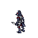 | 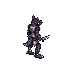 | 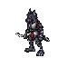 | 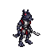 |
| walk | 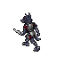 | 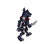 | 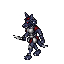 | 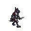 |
| attack | 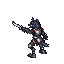 | 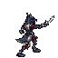 | 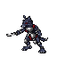 | 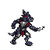 |

## QA 상태

- 개별 이미지 수: 12 (대기 4 + 걷기 4 + 공격 4).
- 프레임 크기: 64×64px, 투명 배경. 이미지마다 단일 몬스터와 단일 포즈만 포함합니다.
- 내부 확인: 각 이미지 전체 실루엣이 프레임 안에 있고, 걷기/공격은 대기와 다른 자세이며, 검·갑옷 색상과 직립형 늑대인간 정체성이 유지됩니다.
- 상태: **후보 / 사용자 시각 수락 대기**. 실제 게임 화면 배율·발 앵커 적합성과 원작 4방향 정합성은 미검증입니다. 이 에셋을 APK에 적용하지 않았습니다.
